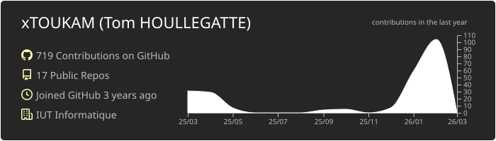
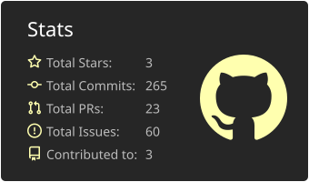
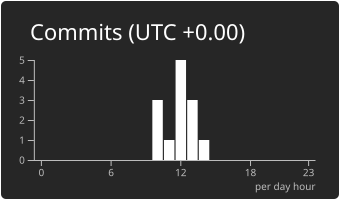

# 👋 Hi, I'm Tom

A developer focused on **backend**, **web**, and **systems**, with a strong interest in performance, maintainability, and software architecture.

I work on both **web applications** and **technical environments** such as infrastructure, virtualization, APIs, and distributed systems.

---

## 📊 GitHub statistics

---

## 🧠 Technical skills

### 🧩 Languages

  
  
  
  
  
  
  
  
  

---

### ⚙️ Frameworks & runtimes

  
  
  

- Vue.js, Laravel and Node.js : **proven use in concrete projects**

---

### 🗄️ Database

  
  
  
  

- Relational and NoSQL Databases
- Modeling, queries, basic optimization

---

### 🛠️ Tools & infrastructure

  
  
  
  

- Git / GitHub / GitLab  
- CLI Linux (Ubuntu, Debian)  
- Proxmox, virtualisation, clusters  
- Kubernetes (bases)

---

### 🔐 Other skills
- Information security (fundamentals, best practices)
- Design and consumption of REST APIs
- Virtualization & isolated environments
- Working in a server / headless environment

---

## 🚀 Objectives
- Design robust and maintainable systems
- Deepen expertise in backend and distributed architectures
- Improve skills in infrastructure and security

---

## 📫 Contact
- GitHub : **@xTOUKAM**
- Mail : **support@warble.fr**

⭐ *Feel free to browse my repositories.*
